# Human Resource Analytics

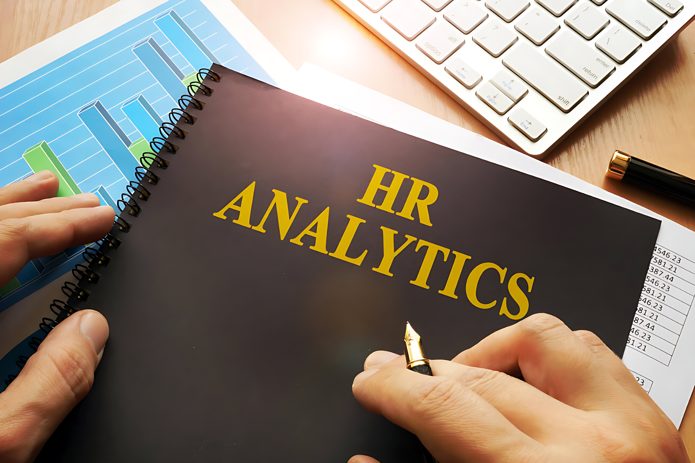

## Introduction
This project is part of the FP20 Analytics Challenge 15, where participants analyze a Human Resource dataset to identify trends and provide insights. The challenge aims to explore various aspects of workforce management, such as diversity, retention, compensation, and turnover rates.

## Problem Statement
The goal of this project was to create a Dashboard to understand workforce composition, retention rates, compensation trends, and other factors affecting employee satisfaction and retention.

## Skills Demonstrated
- Data analysis and visualization using Power BI
- Interactive visualization creation with ZoomCharts
- Data transformation and modeling
- Dashboard
- DAX Measure
- Implement UI/UX
- Next Level KPI

## Data Sourcing
The dataset used in this project is provided as part of the FP20 Analytics Challenge 15. The dataset contains anonymized information about employees, including gender, ethnicity, age, hire date, job title, department, business unit, salary, bonus, and geographical information. The dataset is used to analyze workforce diversity, employee retention, compensation trends, and other key metrics in the Human Resource domain.

More Information About This Challenge _[FP20 Analytics Challenge 15](https://zoomcharts.com/en/microsoft-power-bi-custom-visuals/challenges/fp20-analytics-april-2024)_

## Data Transformation
Data transformation includes cleaning, filtering, and formatting the dataset to prepare it for analysis. This step ensures that the data is accurate and suitable for visualization.

## Modeling
In this project, I created a calendar table to facilitate time-based analysis. The calendar table contains information about dates, months, years, quarters, and more, which allows for better data analysis based on time dimensions. The calendar table is also used to create time relationships in the data model.

| DAX | Result |
|----------|----------|
| 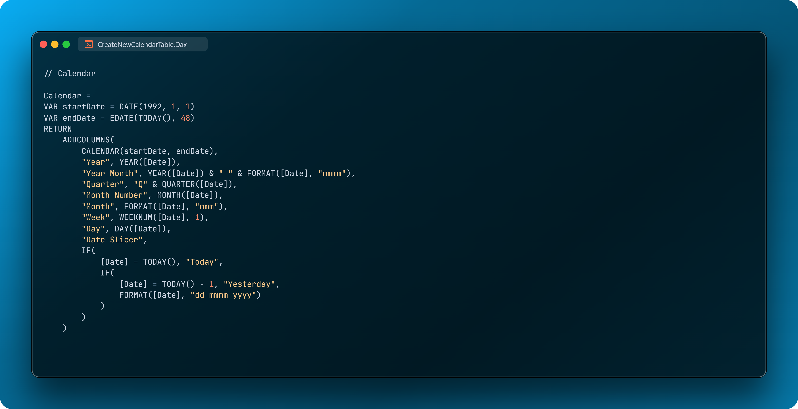 | 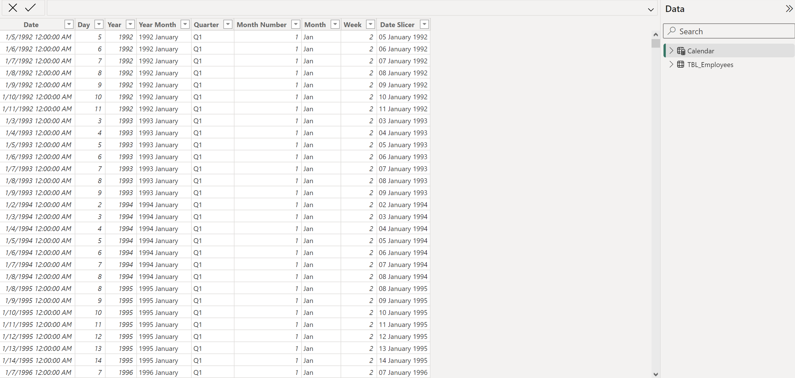 |

And Create Relationship between Calendar Table and Fact Table

Date Column ( Calendar Table ) - Hire Date ( Fact Table )

Date Column ( Calendar Table ) - Exite Date ( Fact Table )

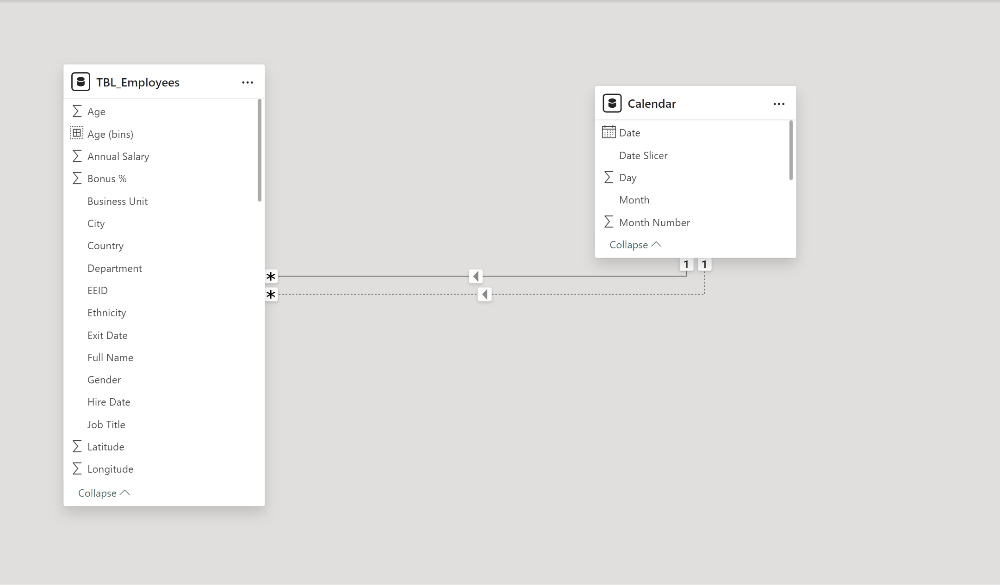

Additionally, I used various DAX measures to calculate time-based metrics and other analyses. For example, I used DAX measures to calculate employee retention, turnover rate, salary changes, annual bonuses, and more. These DAX measures helped me analyze trends and identify patterns in the HR data.

Employee

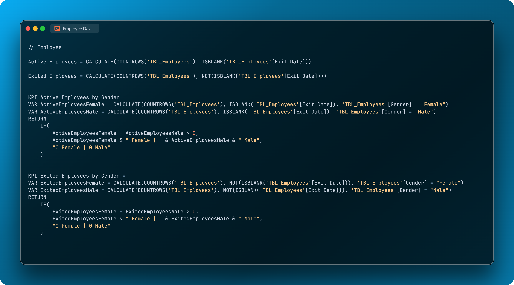

Bonus

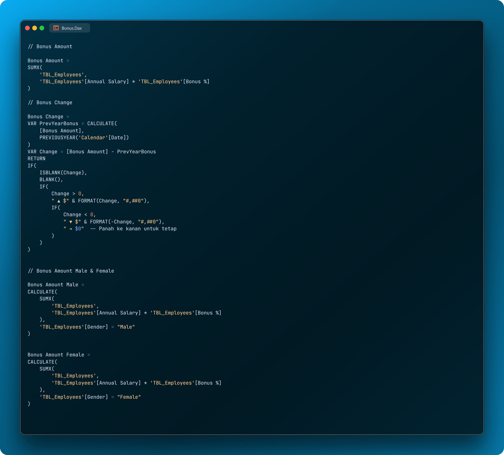

Salary

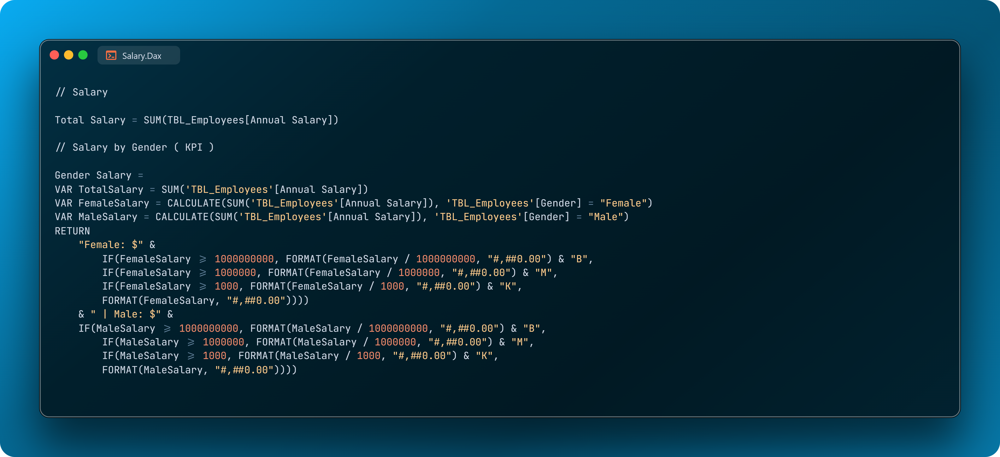

Retention Rate

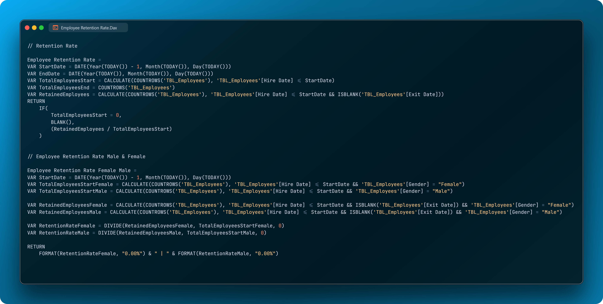

Turnover Rate

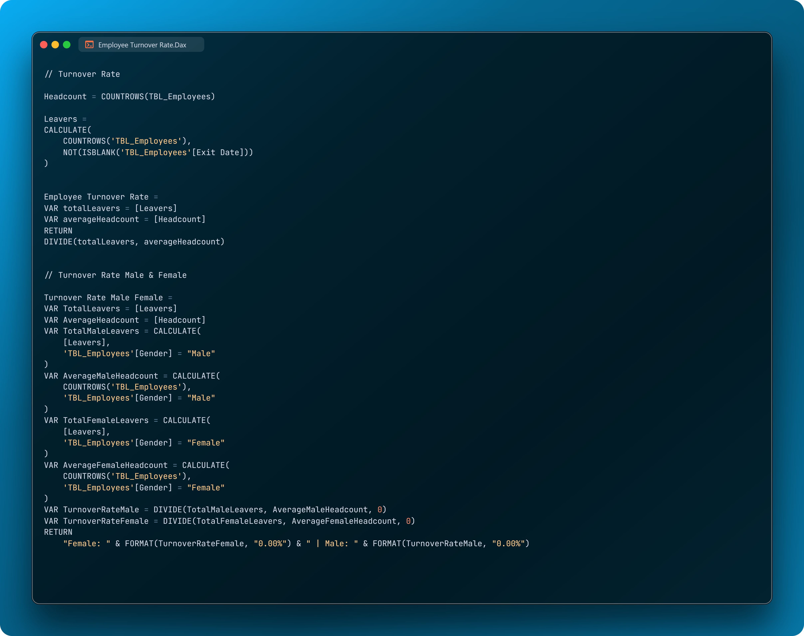

Gender Percentage

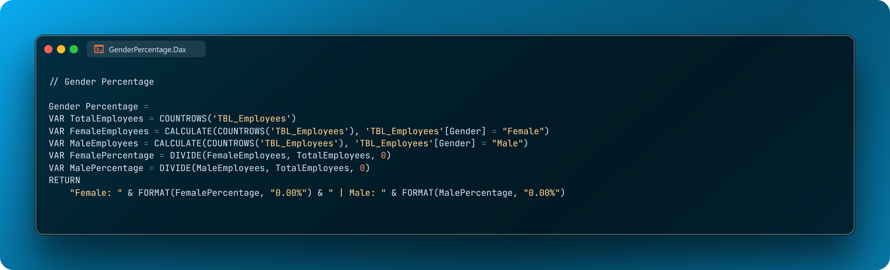

Hires

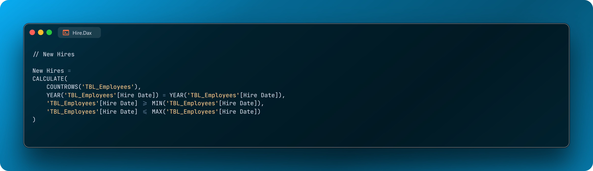

## Analyze & Visualization
In Challenge 15, I identified trends within the Human Resource dataset. Here are some questions I answered in my report:

- How diverse is the workforce in terms of gender, ethnicity, and age?
- Is there a correlation between pay levels, departments, and job titles?
- How about the geographic distribution of the workforce?
- What is the employee retention rate trend yearly?
- What is the employee retention rate in terms of gender, ethnicity, and age?
- Which business unit had the highest and lowest employee retention rate?
- Which business unit and department paid the most and least bonuses annually?
- What is the annual historical bonus trend? Can we show new hires some statistics?
- How about the pay equity based on gender, ethnicity, and age?
- What is the employee turnover rate (e.g., monthly, quarterly, annually) since 2017?

### In this project there are 2 pages :
- Performance
- Payout

You can interact with report here [FP20 Analytics Challenge 15 Dashboard](https://zoomcharts.com/en/microsoft-power-bi-custom-visuals/challenges/submission/f2a84cd464a908a144272b7eb158b079?challenge=fp20-analytics-april-2024)

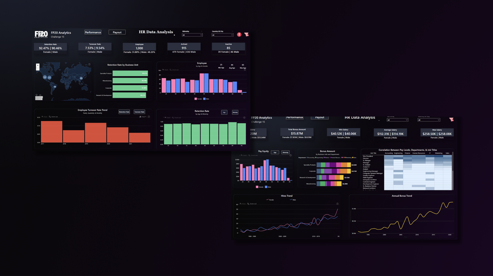

## Conclusion
### Workforce Diversity
- **Gender Diversity:** The data reveals a slight majority of female employees (51.8%) compared to male employees (48.2%).
- **Age Distribution:** Breakdown of employee retention rates by age group: 25-34 (35.4%), 35-44 (31.8%), 45-54 (21.7%), and 55+ (11.1%). This shows a relatively young workforce with a smaller proportion of older employees.
### Employee Retention
- **Overall Retention:** The overall retention rate is impressive at 91.50%, with females showing a slightly higher rate (92.47%) than males (90.46%).
- **Business Unit Retention:** Speciality Products boasts the highest retention rate, while Research & Development lags behind.
### Employee Turnover Rate
- **Overall Turnover:** The overall turnover rate is 8.50%, with men experiencing a higher turnover rate (9.54%) than women (7.53%).
### Compensation
- **Total Salary:** The total salary for the year is $113.20 million, with an average salary of $112.31k.
- **Total Bonus Amount:** The total bonus amount for the year is $15.87 million, with male employees receiving slightly higher bonuses than female employees. Bonus amounts trend upwards from year to year, but there have been significant drops as well.
### Pay Levels
- **Salary Correlation:** The data shows a correlation between employee position and salary, with higher positions correlating to higher salaries.

Based on these insights, it is recommended that the company focuses on strategies to improve retention rates, particularly in departments with lower retention rates. Additionally, further analysis could be done to understand the factors contributing to the fluctuations in bonus amounts and turnover rates.

